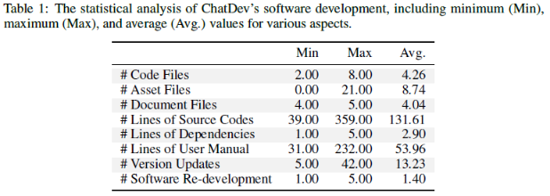

# 0. 背景
* 深度学习领域很久就有在软件工程领域的研究，LLM的出现为代码生成提供了新的方向。
* LLM直接生成大段代码(zreo-shot)容易产生幻觉，原因有二：
  * 实际开发的细颗粒度任务在粗颗粒的宏观场景实现困难————囫囵吞枣嚼不烂
  * 单方面决策导致的高风险————不能兼顾多场景和因素 *？*
* ChatDev：a virtual chat-powered software technology company
  * 将开发过程划分为4个步骤：设计、写代码、测试和生成文档，每个阶段都会有agent扮演不同角色。
  * 通过聊天链(ChatChain)来把不同阶段拆分为原子任务，agent通过多轮交互生成解决方案

# 1. ChatDev
## 1.1 Chat Chanin
* 瀑布模型：将代码开发过程划分为设计、编程、测试和文档生成四个过程，每个过充分割为多个原子聊天过程。
* 双agent交互：每个原子聊天过程由两个agent处理，分别为指令者和助手，两个agent协作直到完成任务
* 
## 1.2 Designing
### 角色指派

### 记忆流

### 自我优化

## 1.3 Coding
### 代码管理 Code Management
* 开发语言为python，面向对象开发，
* 代码更新：在agent之间只保有最新版本的代码，可通过git管理项目
### 思考指引 Thought Instruction
* 为了避免代码生成中LLM产生幻觉，基于CoT提示词，提出了思考指引的方法。通过切换角色，引导LLM一步一步生成、修改和完善代码。
## 2.4 测试 Testing
* 测试方式：同行评审(Peer review，白盒测试，代码审阅) + 系统测试(System testing，黑盒测试)
* 通过思考指引来引导模型合理完成测试和修改过程。
* 用户参与：支持用户通过自然语言参与测试过程，提出修改意见。
## 2.5 文档生成 Documenting
通过LLM的few-shot prompting场景生成代码文档

## 3 实验
### 软件稳定性

* 小部分代码存在执行失败的问题：
  * 一半以上是由于API的token长度限制导致的。
  * 还有一半主要是由于外部依赖导致的。

### 过程分析

### 对话稳定性

## 4. NLDD 数据集

### 5. 讨论
* LLM的随机性不可避免，
* 尽管支持生成图片，但是由于生成的图片是独立步骤，不一定增加GUI视觉效果。*工具调用可能对agent有反作用*
* LLM表现出的固有偏差，导致生成代码模式可能与实际程序员解决问题方法不一致；且生成软件缺乏对于敏感文件恶意意图的识别操作。
* 难以生成大规模软件中所需的完美源码，因为agent针对具体代码细节的处理可能导致复杂冗余的讨论
### 6. 相关工作

### 7. 结论

