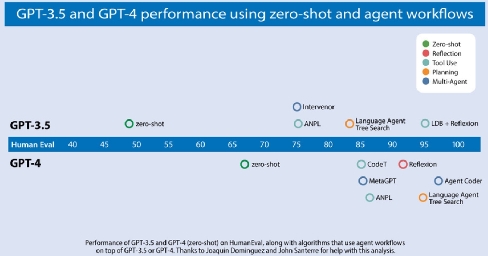

# agentic workflow
## 0. 背景
### **0.1 当前LLM应用情景**
* 目前对于LLM的应用多为zero-shot场景，即无预制场景，一次生成最终答案。
  * 一般的应用场景可以分为0-shot、few-shot。即是否有示例的形式通过prompt传入模型引导输出。
  * langchain支持通过`FewShotChatMessagePromptTemplate`等形式，通过预制模板为LLM提供few-shot。
* 如果结合agentic workflow相关技术，即使是GPT-3.5也能达到极佳效果。

### **0.2 agentic workflow是什么** 
> 然而，通过代理工作流程，我们可以要求LLM多次迭代文档。例如，它可能需要执行一系列步骤，例如：  
> - 规划一个大纲。  
> - 确定需要进行哪些网络搜索（如果需要）来收集更多信息。   
> - 写初稿。   
> - 通读初稿，找出不合理的论点或无关的信息。   
> - 修改草案时考虑到发现的任何弱点。   
> - 等等。  

可以看到agentic workflow本质还是那一套：ReAct、CoT和工具调用。究其本质还是通过prompt engineering来实现引导模型自我迭代
从而最终生成更优质的答案。

## **1. agentic workflow 核心技术**
### **1.1 reflection 反思**
[原文链接](https://www.deeplearning.ai/the-batch/agentic-design-patterns-part-2-reflection/)  
* **提示词引导(prompt engineering)**：借助提示词工程和上下文记忆，让模型自己修改输出内容，从而达到完善输出内容的功能。
> eg：(提示词内容：) *以下是用于任务 X 的代码：[先前生成的代码]仔细检查代码的正确性、风格和效率，并对如何改进给出建设性的
> 批评。*
* **工具(tools)**：通过为LLM提供工具来帮助评估其输出，从而能够超过自我反思的效果。
> eg：通过一些单元测试运行其代码,以检查它是否在测试用例上生成正确的结果，或者搜索网络以仔细检查文本输出。然后它可以反思发
> 现的任何错误并提出改进的想法。
* **多代理框架(muti-agent)**：创建两个不同的代理，一个提示生成良好的输出，另一个提示对第一个代理的输出提出建设性批评。两个代理之间的讨论有助于了响应的改进。

#### Self-Refine：通过自我反馈实现迭代细化
:construction:*building*  
(ToDo:paper note)

#### Reflexion：具有语言强化学习的LM
:construction:*building*  
(ToDo:paper note)

#### CRITIC:LLM可以通过工具的交互式批评进行自我纠正
:construction:*building*  
(ToDo:paper note)

### **1.2 tool use 工具调用**
[原文链接](https://www.deeplearning.ai/the-batch/agentic-design-patterns-part-3-tool-use)  
* 定义：一般指LLM被赋予其可以请求收集信息、采取行动或操作数据的功能，如执行网络搜索或执行代码等。
  * 实质上通过外部环境来增强LLM的能力，在调用工具的场景下，LLM本身实际上是负责决策(选择工具)和信息整理的工作。
* 通过prompt让LLM生成API calls选择并调用对应的函数完成工作。
* RAG+tools use：当可用函数或工具过多时，可以通过RAG等形式，帮助LLM选择正确的工具。
* 大型多模态模型(LMM)与大语言模型(LLM):目前的LMM实际上从训练就以duo

#### Gorilla：与海量API连接的LLM
[论文笔记](【论文笔记】Gorilla——大模型连接海量API.md) / [原文链接](https://arxiv.org/abs/2305.15334)
* 主要介绍了一个基于LLaMA-7B的微调模型，能够在生成API调用的场景实现优于GPT-4级别的效果。同时基于检索感知的训练，能够让LLM适应API文档频繁变化的场景。  
* 微调数据集APIBench：主要来源于主流ML平台(TorchHub、TensorHub和Huggingface)，共1645条API调用方法。同时使用self-instruct技术，通过GPT-4针对
以上的数据集的内容生成了对应的user-agent形式的微调语料。
* AST子树匹配技术：基于AST子树匹配技术评估查找正确性。例如生成torch.hub.load的形式，以便用于检索数据集。

#### MM-REACT：提示chatGPT进行多模式推理和行动
:construction:*building*  
(ToDo:paper note)

#### 通过抽象链推理实现高效工具的的使用
:construction:*building*  
(ToDo:paper note)

### **1.3 planning 规划**
[原文链接](https://www.deeplearning.ai/the-batch/agentic-design-patterns-part-4-planning)  
* 定义：使用大型语言模型 (LLM) 来自主决定执行哪些步骤顺序来完成更大的任务。例如，如果我们要求代理对给定主题进行在线研究，我
们可能会使用法学硕士将目标分解为更小的子任务，例如研究特定子主题、综合发现和编写报告。 
  * LLM的planning能力本身还是基于CoT实现的
* 有的workflow可以不使用planning，但是对于部分无法预先进行分解的任务，planning可以帮助其动态规划。  
* planning也会导致结果可控性、可预测性低。  

#### 思维链(CoT)可以刺激LLM进行推理
[原文链接](https://arxiv.org/abs/2201.11903)
:construction:*building*  
(ToDo:paper note)

#### HuggingGPT:通过chatGPT和他在huggingface上的朋友们，解决AI任务
:construction:*building*  
(ToDo:paper note)

#### 关于理解LLM agent的规划能力的调查
[原文链接](https://arxiv.org/abs/2402.02716)
:construction:*building*  
(ToDo:paper note)

### **1.4 muti-agent collaboration 多智能体合作**
[原文链接](https://www.deeplearning.ai/the-batch/agentic-design-patterns-part-5-multi-agent-collaboration/)
* 定义：对于复杂任务，将任务分解成为多个角色(即多个agent)对应的子任务，并分别执行、协作完成工作。
  * > eg: 一个软件公司可能包括：开发工程师、测试工程师、运维工程师、项目经理.....多个角色有各自的任务，众人协作推进项目进行
* muti-agent有用的原因：
  * 消融实验表明：muti-agent效果优于单agent
  * 尽管支持长上下文，但LLM对于长上下文的理解能力参差不齐。因此专职工作帮助特定agent在具体任务达到更优效果。
  * muti-agent实际将任务进行了分解和流程化。
* 未来仍需加强方向：
  * memory：如何让每个agent有足够的memory来使其work well
  * muti-agent协作的输出质量难以预测，尤其当单个agent的自由度越高，其整体的可控性越差。
* 推荐框架：
  * AutoGen
  * Crew AI
  * LangGraph
  * ChatDev

#### ChatDev：用于软件开发的交互型agent
:construction:*building*  
(ToDo:paper note)

#### AutoGen:通过多代理对话启用下一代LLM应用程序
:construction:*building*  
(ToDo:paper note)
#### MetaGPT：多代理协作框架的元编程
:construction:*building*  
(ToDo:paper note)

#### 总结：主流muti-agent产品的特点
:construction:*building*  
(ToDo)

## **2. 其他参考案例**
### **2.1 DB-GPT**
:construction:*building*  
(ToDo)

### **2.2 DYFI**
:construction:*building*  
(ToDo)

## **3. 个人思考**
关于agentic workflow的意义：
* **面向流程开发** 对应数据结构的DAG流程图，可以更根据具体场景定制开发。
* **可控性** 原始react流程，通过prompt辅助模型进行迭代推理，可能导致幻觉等不可靠的情况。workflow通过代码和人为手动控制流程，确保每个流程图节点的输入输出可控。
* **功能封装** AGENT本质还是prompt engineering。LLM本质是工具，通过prompt辅助输出，实际还是通过概率生成可能性最高的结果。通过流程化、节点化和模块化，以封装的形式将LLM的能力具象化、方向限定(有助于生成内容更精准更)
* **类比FLARE** 自我迭代、优化从而生成更完善的回答。https://arxiv.org/abs/2305.06983