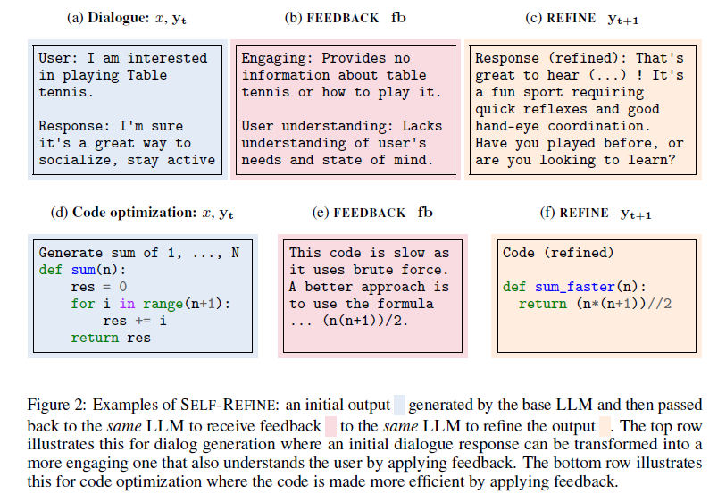
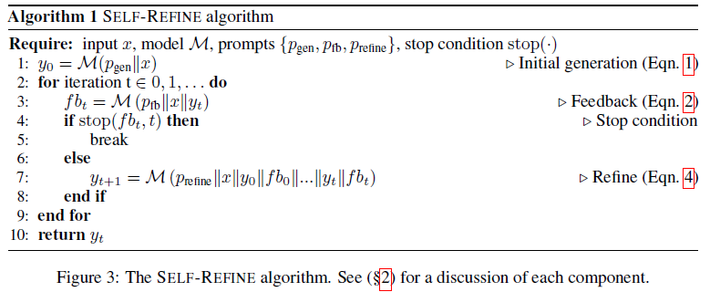
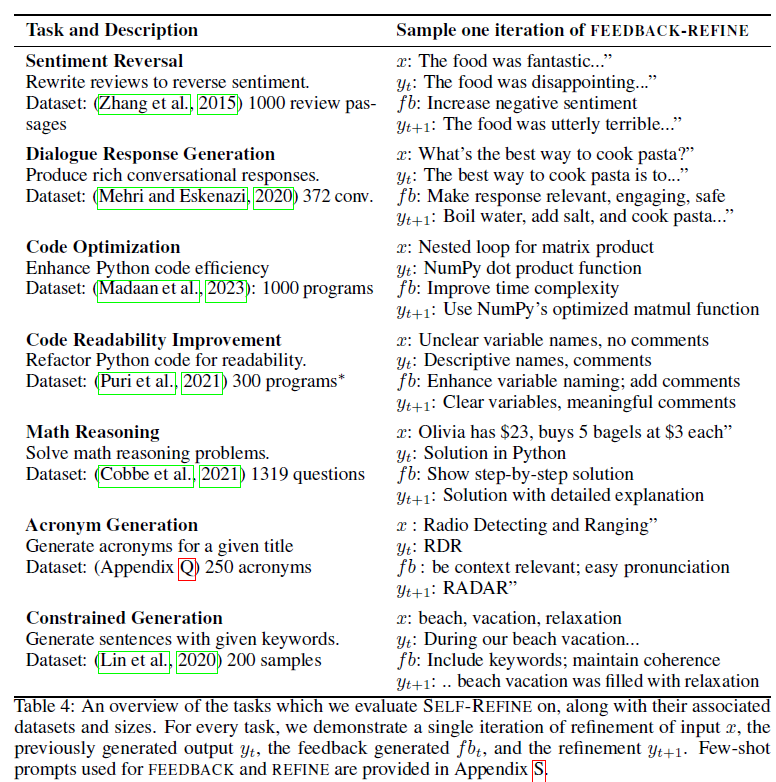
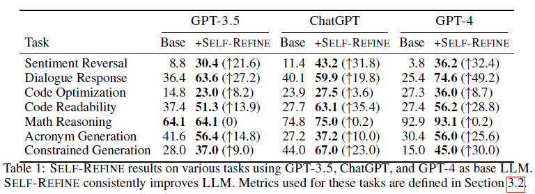

# Self-Refine:Iterative Refinement with Self-Feedback
[原文链接](https://arxiv.org/abs/2303.17651)
## 0. 背景
* 问题：LLM在处理复杂问题的能力仍有不足，如：面向多目标任务（对话响应生成）和难定义目标任务（如增加代码可读性）。
* 现有的进行输出内容优化的方式：
  * 迭代强化：通过依赖特定领域数据的强化模型，优化原始输出内容。
  * 外部监督或奖励模型：缺点是需要大规模训练集或人工标注，且缺乏灵活性

## 1. Self-refine的迭代过程
Self-refine是基于人类解决问题逻辑抽象而来的，主要分为：初始内容生成和基于自我反馈的优化。
* 初始化生成(Initial generation)：input+初始提示词传入LLM，生成初始的内容。
* 反馈(Feedback):使用相同的LLM，基于初始生成内容和特定任务的提示词，生成反馈内容。
* 优化(Refine)：使用相同的LLM，基于反馈内容来优化最近的输出内容。
* 迭代的自我优化(Iterating SELF-REFINE)：在反馈和优化两个步骤中持续迭代，直到达到最大迭代次数或生成内容达到需要。
  * 为了帮助LLM持续迭代优化，需要在提示词中保存历史反馈和优化记录   

## 2. 实验
### 实验示例  
  
### 实验结果  
  
### 实验结论
* **Self-Refine显著提升原模型能力。**
  * 在测试的各个领域中，最终结果都有明显的优化。
  * 受限内容生成（Constrained Generation）的效果最好，即根据30个给定的概念，生成一个句子。首次尝试的场景很容易遗漏部分概念，
而Self-Refine给了模型机会去完善他的答案。
  * 数学逻辑推理（Math Reasoning）提升效果不明显主要是由于出错的地方不明显，可能某一行不起眼的错误导致整个结论完全错误。
作者通过额外的实验证明了，如果借助外部工具识别数学推理中的错误，能够更显著的帮助LLM优化结果。(*所以本质上，数学逻辑推理优化效果差还是feedback质量差*)
* **提升效果依赖基础模型尺寸。**
  * 如GPT-4的提升效果比ChatGPT的效果好，作者认为Self-refine能够使更强的模型解锁他的全部潜力。

## 3. 分析
* **反馈质量至关重要** 针对性的反馈效果比一般通用的反馈效果好，所以问题在于如何生成更针对性的反馈。
  * *可以尝试的*
* **反馈优化多次迭代的重要性** 多次迭代显著增加了输出内容的质量，但是也存在边际效益递减的情况。因此文中也提出了针对不同不同的数值分数，
用于平衡质量和合适的输出选择
* **多次输出不可替代优化** Self-Refine的效果优于LLM直接生成多个初始output效果。
* **Self-Refine不能用于效果很差的模型** 文中测试了在Vicuna-13B模型上使用Self-Refine，结果难以生成针对初始output的反馈，
同时期望根据Self-Refine进行优化时，发现模型更容易产生相同的输出或幻觉。
  * *对于小模型或性能较差的模型，至少要有稳定的输出和理解能力，才能通过Self-Refine实现优化效果。*
* **质量分析** 在测试领域上的任务，难点在于是否能够正确指出初始生成内容中存在的问题，而不在于优化过程中。并且即使反馈存在部分错误内容，
也能够实现优化的效果。
* **测试集之外的效果** 作者以网页生成作为现实世界中的用例对Self-Refine进行了测试，发现效果较好，进一步证明Self-Refine在现实世界中能够起到作用

## 4. 相关研究&限制
### 相关研究
* **反馈源设置** 最高效的反馈源是人类；也有奖励模型来代替人类反馈；wiki等也可以作为特定领域的反馈源。
* **反馈形式** 可以分为自然语言和非自然语言反馈，非自然语言反馈可以以人类提供的示例对或者奖励模型实现
* **优化器种类**
* **非优化式的强化学习方法**
### 限制
* 模型需要足够的few-shot场景生成能力，用于生成反馈和优化。
* 测试仅使用GPT系列闭源模型，具体技术细节不可知，且使用需要收费
* 测试语言集仅为英语
* 对于不熟练使用prompt engineering的人可能生成有毒或有害内容。

## 5. 个人总结
* Self-Refine可实现，但是目前没有通用的范式能够广泛运用在各个场景。
  * 如何解决针对性输出feedback？尤其是针对模型无法自我感知问题的场景。文章提到了通过外部工具来实现，如wiki等。即可以通过tools use来辅助模型验证输出质量。
* Self-Refine其实是锦上添花。
  * 我们从实验结果中可以看到，不同模型在不同场景本身各有优劣，即使有Self-Refine进行优化后，仍然在具体场景有较大差别。